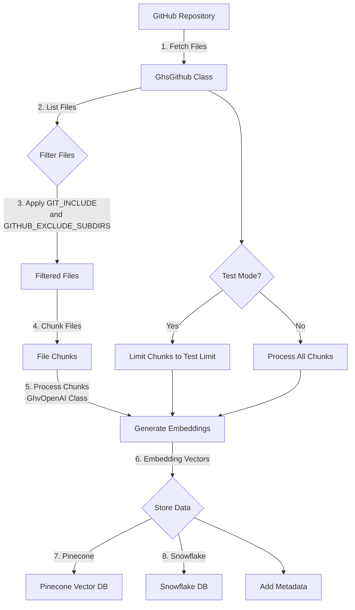
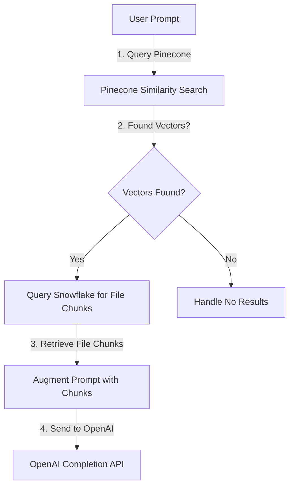

# ghvector - Vectorize chunks from Github repos

Chunks up code, creates embeddings, stores them in Pinecone, and stores the metadata and original chunks in Snowflake.

# Generating Embeddings from Github



## Retrieving Embeddings and Augmenting a Generated Prompt



## Embedding models

Which embedding model you use has a lot to do with the type of content you are vectorizing. Price should be considered also.
The dimensions value must match your Pinecone settings also.

[Learn about embeddings](#)

| Model                  | Dimensions | Pricing            | Pricing with Batch API |
| ---------------------- | ---------- | ------------------ | ---------------------- |
| text-embedding-3-small | 1,536      | $0.020 / 1M tokens | $0.010 / 1M tokens     |
| text-embedding-3-large | 3,072      | $0.130 / 1M tokens | $0.065 / 1M tokens     |
| ada v2                 | 1,536      | $0.100 / 1M tokens | $0.050 / 1M tokens     |

# Install

```bash
python3 -m venv venv
source venv/bin/activate
pip3 install -r requirements.txt
python3 ghdeps.py
```

# Settings - the .env file should have

```
# GitHub Settings
GITHUB_API_TOKEN=
REPO_OWNER=
REPO_NAMES=
GIT_INCLUDE=*.py,*.java,*.js,*.ts,*.html,*.css,*.json,*.yml,*.yaml,*.md,*.txt,*.csv,*.tsv,*.xml,*.sql,*.sh,*.bat
GITHUB_EXCLUDE_SUBDIRS=

# Snowflake Settings
SNOWFLAKE_USER=
SNOWFLAKE_PASSWORD=
SNOWFLAKE_ACCOUNT=
SNOWFLAKE_WAREHOUSE=
SNOWFLAKE_DB=
SNOWFLAKE_SCHEMA=

# Pinecone and OpenAI Shared Settings (this needs to match your selected model)
EMBEDDING_DIMENSIONS=1536

# Pinecone Settings
PINECONE_API_KEY=
PINECONE_DIMENSION=512
PINECONE_METRIC=cosine
PINECONE_CLOUD=aws
PINECONE_REGION=us-east-1
PINECONE_PROJECT_NAME=
# The full index name is built from the base, the embedding model, and dimensions
PINECONE_BASE_INDEX_NAME=
# true in test mode will cause all indexes to be deleted at GhvPicecone init
PINECONE_TEST_MODE=

OPENAI_API_KEY=
OPENAI_EMBEDDING_MODEL=
OPENAI_EMBEDDING_DIMENSIONS=512

```
