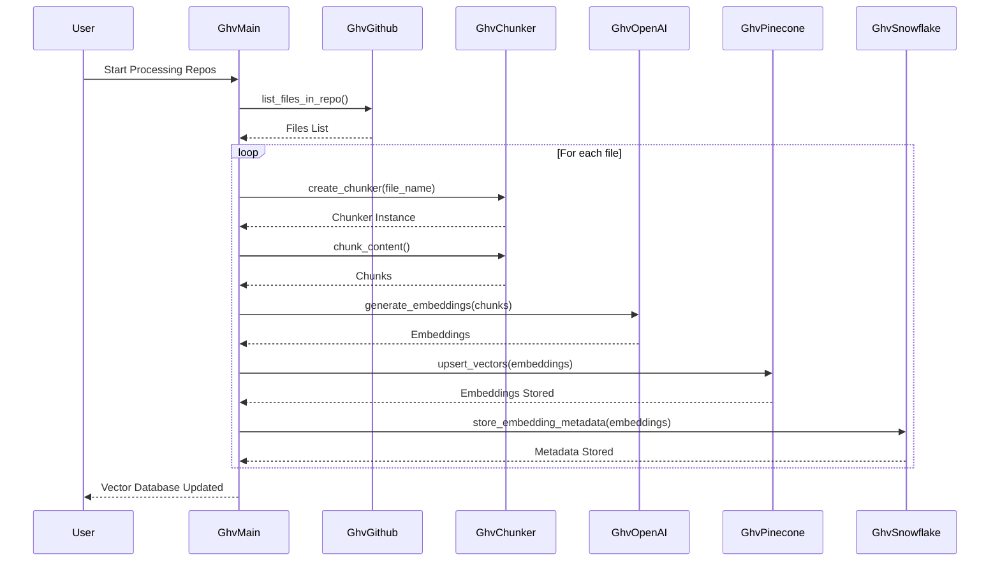
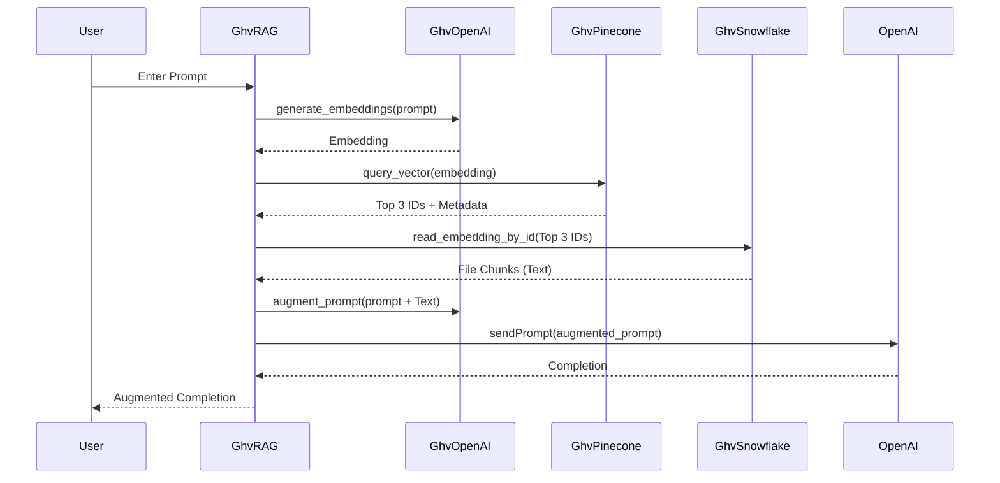

# ghvector - Vectorize chunks from Github repos

Chunks up code, creates embeddings, stores them in Pinecone, and stores the metadata and original chunks in Snowflake.
After building the databases, running the main program will prompt the user for a code question. This prompt is augmented with the results of an embedding vector query on the stored chunks. This augmented prompt is passed on to the OpenAI Completions API.

### Supported file types

- python
- java
- sql
  Adding others is easy thanks to the abstract base class GhvChunker

### Program structure

#### Preparation

This program is a set of interdependent utilities. The process to prepare the databases is:

1. Iterate through GitHub repos
2. Using a factory pattern, decide on what file chunker is needed (based on supported file types). Chunk the files.
3. Generate embeddings per chunk, using the OpenAI Embeddings API
4. Store these embeddings, with their metadata, in Pinecone's Vector DB
5. Store additional metadata in Snowflake. Note: this may be redundant. Unclear the cost trade-offs currently.

#### Retriever Augmented Generation (prompting)

Once the databases are set up:

1. the user submits a code-related prompt
2. the prompt is converted to an embedding
3. this embedding is passed in as a query to Pinecone
4. The top results from Pinecone are merged into the prompt
5. The prompt is passed to OpenAI's Completions API

## Example

This example is based on the code in this repo being chunked and stored in Pinecone. The prompt is not surprisingly based on chunking to demonstrate relevance. The prompt is simplified and doesn't include any GitHub, Pinecone, or Snowflake references.

### Prompt example

write me a python file chunker that opens a python file and breaks up .py code files into logical chunks and returns a list of chunks

## Response from the RAG process

To create a Python file chunker that breaks up `.py` code files into logical chunks, we can follow the structure you’ve provided and implement the `chunk_content` method to parse the Python code. The chunking can be based on functions, classes, or other logical blocks of code. We can utilize the `ast` (Abstract Syntax Tree) module to help identify these structures.

Below is a complete `PythonChunker` class that incorporates the context you've provided and defines the `chunk_content` method to chunk the content of a Python file logically.

```python
import ast

class PythonChunker:
    MAX_CHUNKS_PER_FILE = 100  # Define a limit to the number of chunks

    def __init__(self, file_name: str = None):
        self.file_name = file_name
        self.file_type = self.get_file_type() if file_name else None
        self.content = ""
        self.chunks = []

        if file_name:
            self.content = self.read_limited_file(file_name)

    def get_file_type(self):
        """Returns the type of the file based on its extension."""
        return self.file_name.split('.')[-1] if self.file_name else None

    def read_limited_file(self, file_name):
        """Read content from the specified file."""
        with open(file_name, 'r', encoding='utf-8') as file:
            return file.read()

    def chunk_content(self):
        """Chunk the content of the Python file into logical parts."""
        try:
            # Parse the content into an AST
            tree = ast.parse(self.content)
            for node in ast.walk(tree):
                # Chunk based on functions and classes
                if isinstance(node, (ast.FunctionDef, ast.ClassDef)):
                    chunk = self.get_source(node)
                    self._add_chunk(chunk)
        except SyntaxError as e:
            print(f"Error parsing the file {self.file_name}: {e}")

    def get_source(self, node):
        """Get the source code for a given AST node."""
        return ast.get_source_segment(self.content, node)

    def _add_chunk(self, chunk: str) -> int:
        """Add a chunk to the list of chunks if under the limit."""
        if len(self.chunks) < self.MAX_CHUNKS_PER_FILE:
            self.chunks.append(chunk)
            print(f"\r\tAdded chunk {len(self.chunks)}", end="")
        else:
            print(f"\n\tMax chunks of {self.MAX_CHUNKS_PER_FILE} per file limit reached.")
        return len(self.chunks)

    def get_chunks(self):
        """Return the list of chunks."""
        return self.chunks

# Sample usage
if __name__ == "__main__":
    chunker = PythonChunker("example.py")
    chunker.chunk_content()
    chunks = chunker.get_chunks()
    for i, chunk in enumerate(chunks, start=1):
        print(f"Chunk {i}:\n{chunk}\n")
```

### Explanation of the Code:

- **`PythonChunker` Class**: The main class responsible for chunking the Python file.
- **Initialization**: Takes a filename, reads its content, and prepares to chunk it.
- **`get_file_type`**: Method to retrieve the file extension.
- **`read_limited_file`**: Opens and reads the Python file.
- **`chunk_content`**: Uses Python's `ast` module to parse the content and identify functions and classes for chunking.
- **`get_source`**: Retrieves the source code for a specific AST node.
- **`_add_chunk`**: Adds the extracted chunk to the `chunks` list if it hasn't reached the predefined limit.
- **`get_chunks`**: Returns the list of all collected chunks.

### Usage Instructions:

1. Place this code in a `.py` file.
2. Replace `"example.py"` in the sample usage part with the path to your target Python file.
3. Run the script to see chunks of the file printed to the console.

This should help you break Python code files into logical parts effectively!

# Program Flow

## Sequence Diagram: building the RAG databases from file content



## Sequence Diagram: Prompt Generation



## Embedding models

Which embedding model you use has a lot to do with the type of content you are vectorizing. Price should be considered also.
The dimensions value must match your Pinecone settings also.

[Learn about embeddings](#)

| Model                  | Dimensions | Pricing            | Pricing with Batch API |
| ---------------------- | ---------- | ------------------ | ---------------------- |
| text-embedding-3-small | 1,536      | $0.020 / 1M tokens | $0.010 / 1M tokens     |
| text-embedding-3-large | 3,072      | $0.130 / 1M tokens | $0.065 / 1M tokens     |
| ada v2                 | 1,536      | $0.100 / 1M tokens | $0.050 / 1M tokens     |

# Install

```bash
python3 -m venv venv
source venv/bin/activate
pip3 install -r requirements.txt
vi .env
```

# Run the program

Make sure you set up your .env file before running.

## Chunking mode

```bash
python3 ghvector_main.py
```

## Prompt mode

```bash
python3 ghv_rag.py
```

# Settings - the .env file should have

```
# GitHub Settings
GITHUB_API_TOKEN=
REPO_OWNER=
REPO_NAMES=
GIT_INCLUDE=*.py,*.java,*.js,*.ts,*.html,*.css,*.json,*.yml,*.yaml,*.md,*.txt,*.csv,*.tsv,*.xml,*.sql,*.sh,*.bat
GITHUB_EXCLUDE_SUBDIRS=

# Snowflake Settings
SNOWFLAKE_USER=
SNOWFLAKE_PASSWORD=
SNOWFLAKE_ACCOUNT=
SNOWFLAKE_WAREHOUSE=
SNOWFLAKE_DB=
SNOWFLAKE_SCHEMA=

# Pinecone and OpenAI Shared Settings (this needs to match your selected model)
EMBEDDING_DIMENSIONS=1536

# Pinecone Settings
PINECONE_API_KEY=
PINECONE_METRIC=cosine
PINECONE_CLOUD=aws
PINECONE_REGION=us-east-1
PINECONE_PROJECT_NAME=
# The full index name is built from the base, the embedding model, and dimensions
PINECONE_BASE_INDEX_NAME=
# true in test mode will cause all indexes to be deleted at GhvPicecone init
PINECONE_TEST_MODE=

OPENAI_API_KEY=
OPENAI_EMBEDDING_MODEL=text-embedding-ada-002
OPENAI_COMPLETIONS_MODEL=gpt-4o-mini

```
